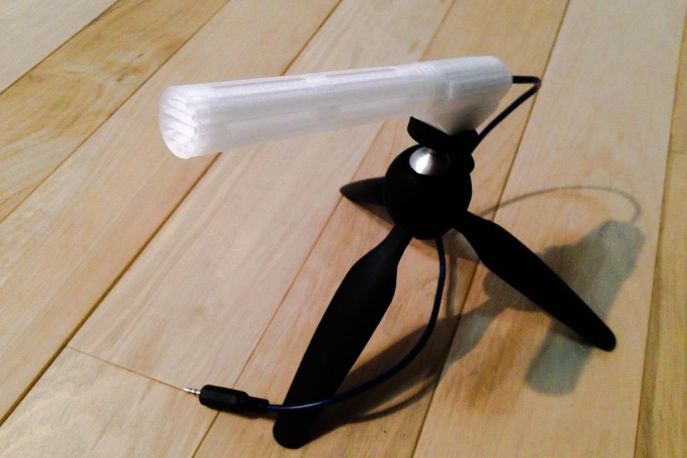
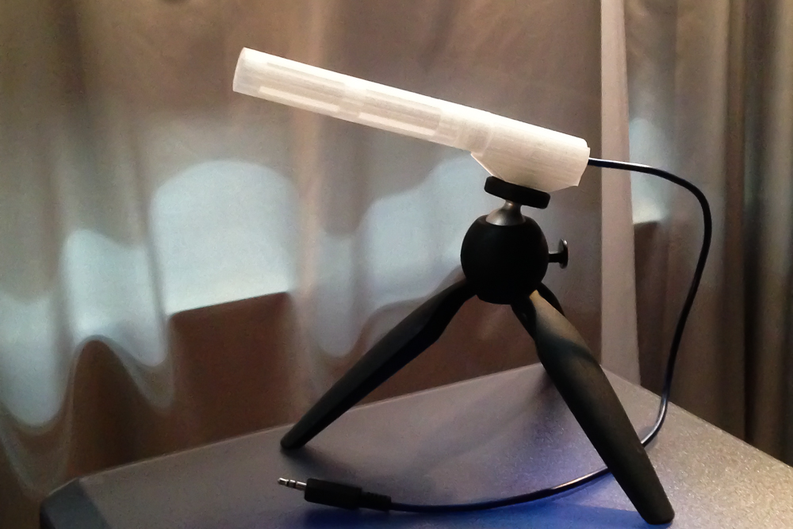
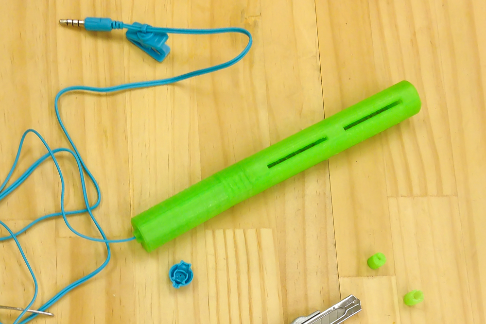

#Spear Microphone Project

Self-Build Microphone Project Series,   
  
- to experience self-building a microphone
- to turn attention to sound around daily life  
- to grow one's environment recognition some richer and ENJOY IT!  

Each project is OPEN SHARED as open source hardware.  
See details on the website of each content.  
Looking foward to see your feedback!!  

##1. Spear Microphone

###Goal:  

- to Make More Primitive, More Physical Microphone  
- to Recognize that Recording is one of the Athletics   

So it is produced not "Shotgun microphone" but "**Spear Microphone**".

###How to Make:  
under construction  

##2. NCS Microphone

NEVER CALL "SHOTGUN Microphone"  

  

###Goal:  

- to Self-Build Microphone 

- to Make Colorful Microphone  
*Sound Equipment can have More Color?*

- to Enjoy Sound around the World through an Experience with this Microphone

###How to Make:
   

####1. Instruction  
  
######[NCS Microphone](http://fabble.cc/yosukesakai/ncs-microphone) (Fabble)    
Regular version.  
Print model parts with 3D printer and get some parts  in market, then build it.  
  

######[NCS Microphone (100 yen smartphone headset ver.)](http://fabble.cc/yosukesakai/ncs-microphone-100yen-smartphone-headset-ver) (Fabble)  
This is a variation of using a smartphone headset which is available in market, assembling 3d printed parts which are same as regular version.  
You can make it **WITHOUT ANY SOLDERING** and use it as regular external microphone of smartphone.
  
 
####2. STL file

STL file for body parts (tube part, bottom part, cable stopper) and microphone holder

######[NCS Microphone](http://www.thingiverse.com/thing:1666150) (Thingiverse)  

###Sound Sample:  
#####*Bishanohana* (fieldrecording)  
[recorded with NCS Microphone (100 yen smartphone headset ver.) + iPhone](https://w.soundcloud.com/player/?url=https%3A//api.soundcloud.com/tracks/272745045&amp;color=ff5500&amp;auto_play=false&amp;hide_related=false&amp;show_comments=true&amp;show_user=true&amp;show_reposts=false)  

<iframe width="100%" height="166" scrolling="no" frameborder="no" src="https://w.soundcloud.com/player/?url=https%3A//api.soundcloud.com/tracks/272745045&amp;color=ff5500&amp;auto_play=false&amp;hide_related=false&amp;show_comments=true&amp;show_user=true&amp;show_reposts=false"></iframe>

*for reference*  
[recorded with audio-technica AT9944 + iPhone](https://w.soundcloud.com/player/?url=https%3A//api.soundcloud.com/tracks/272742016&amp;color=ff5500&amp;auto_play=false&amp;hide_related=false&amp;show_comments=true&amp;show_user=true&amp;show_reposts=false)  
<iframe width="100%" height="166" scrolling="no" frameborder="no" src="https://w.soundcloud.com/player/?url=https%3A//api.soundcloud.com/tracks/272742016&amp;color=ff5500&amp;auto_play=false&amp;hide_related=false&amp;show_comments=true&amp;show_user=true&amp;show_reposts=false"></iframe>

#####*Hinoyama* (fieldrecording)  
[recorded by with Microphone (100 yen smartphone headset ver.) + iPhone](https://w.soundcloud.com/player/?url=https%3A//api.soundcloud.com/tracks/272746818&amp;color=ff5500&amp;auto_play=false&amp;hide_related=false&amp;show_comments=true&amp;show_user=true&amp;show_reposts=false)  
<iframe width="100%" height="166" scrolling="no" frameborder="no" src="https://w.soundcloud.com/player/?url=https%3A//api.soundcloud.com/tracks/272746818&amp;color=ff5500&amp;auto_play=false&amp;hide_related=false&amp;show_comments=true&amp;show_user=true&amp;show_reposts=false"></iframe>

  
*for reference*  
[recorded with NCS Microphone (100 yen smartphone headset ver.) WITHOUT TUBE + iPhone](https://w.soundcloud.com/player/?url=https%3A//api.soundcloud.com/tracks/272745868&amp;color=ff5500&amp;auto_play=false&amp;hide_related=false&amp;show_comments=true&amp;show_user=true&amp;show_reposts=false)   
<iframe width="100%" height="166" scrolling="no" frameborder="no" src="https://w.soundcloud.com/player/?url=https%3A//api.soundcloud.com/tracks/272745868&amp;color=ff5500&amp;auto_play=false&amp;hide_related=false&amp;show_comments=true&amp;show_user=true&amp;show_reposts=false"></iframe>

##3. Next Project
Coming Soon..  
  
  
  
