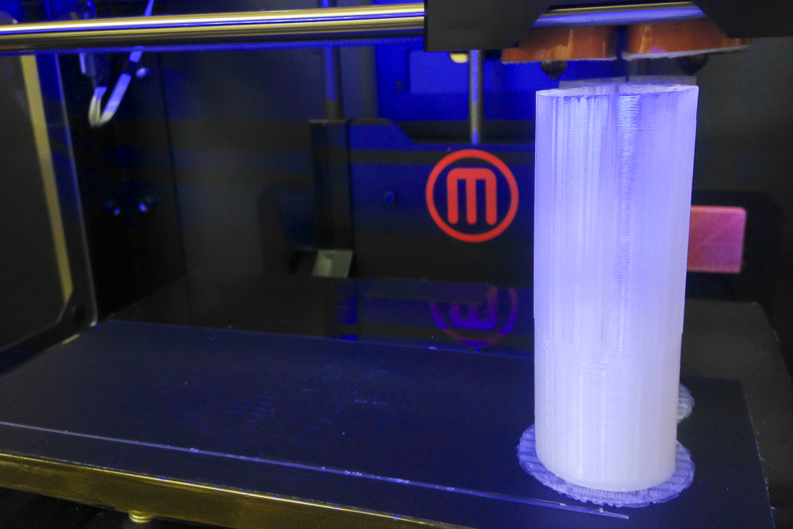
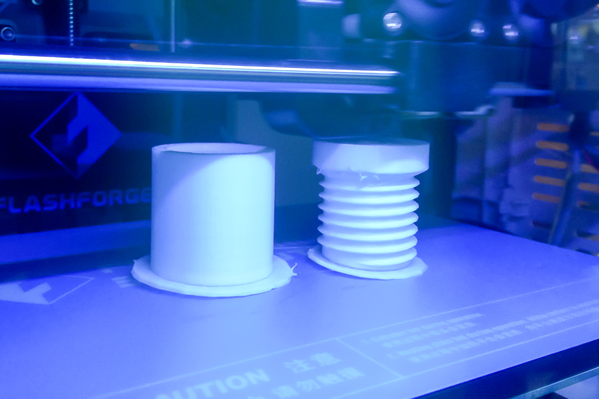
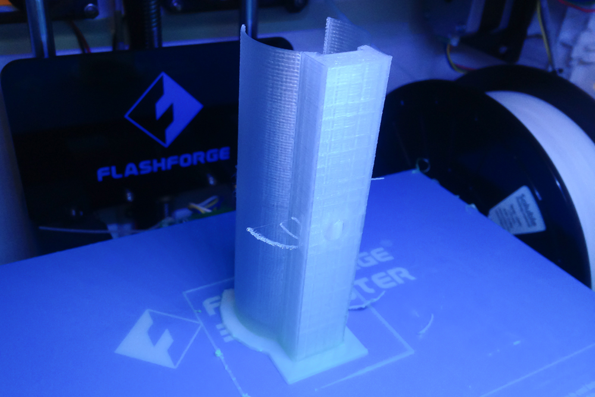

#Spear Microphone Project

--

###Goal:  

- to Make More Primitive, More Physical Microphone  
- to Recognize that Recording is one of the Athletics   
- and ENJOY IT!

So it is produced not "Shotgun microphone" but "**Spear Microphone**".

###How to Make:  
under construction..  

 
 
  

###Sound Sample:    

under construction..  
  
  
----
This is one of the Self-Build Microphone Project Series,   
  
- to experience self-building a microphone
- to turn attention to sound around daily life  
- to grow one's environment recognition some richer and ENJOY IT!  

Each project is OPEN SHARED as open source hardware.  See details and licenses on the website of each content.  
Looking foward to see your feedback!!  

Related projects  

[NCS Microphone Project](https://github.com/yosukesakai/Spear_Michrophone_Project)  
[Spear Microphone Project](https://github.com/yosukesakai/Spear_Michrophone_Project) (this project)    

next project is coming soon..

--
